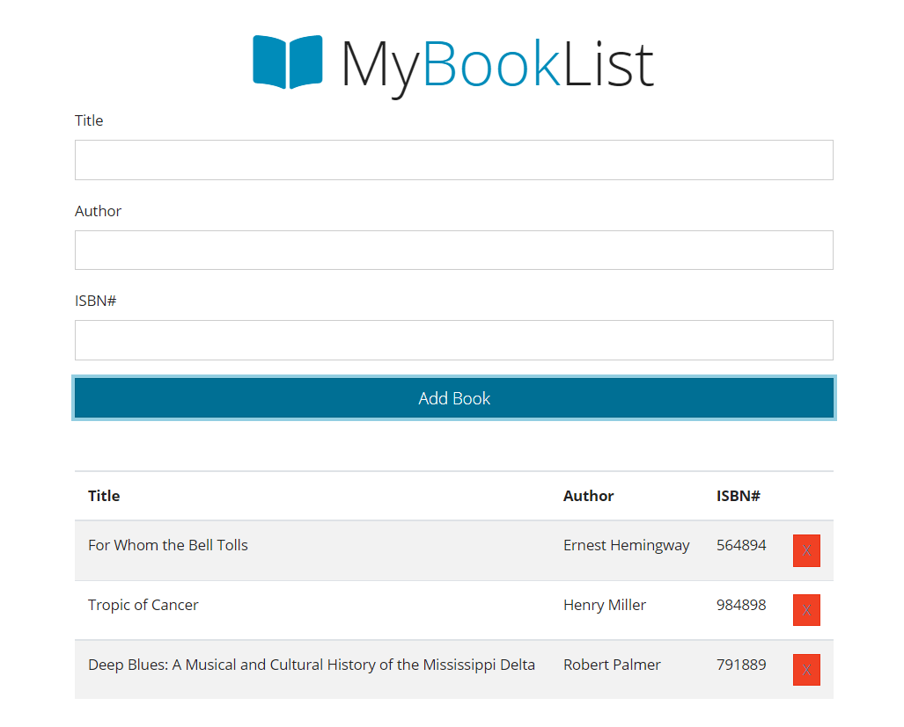
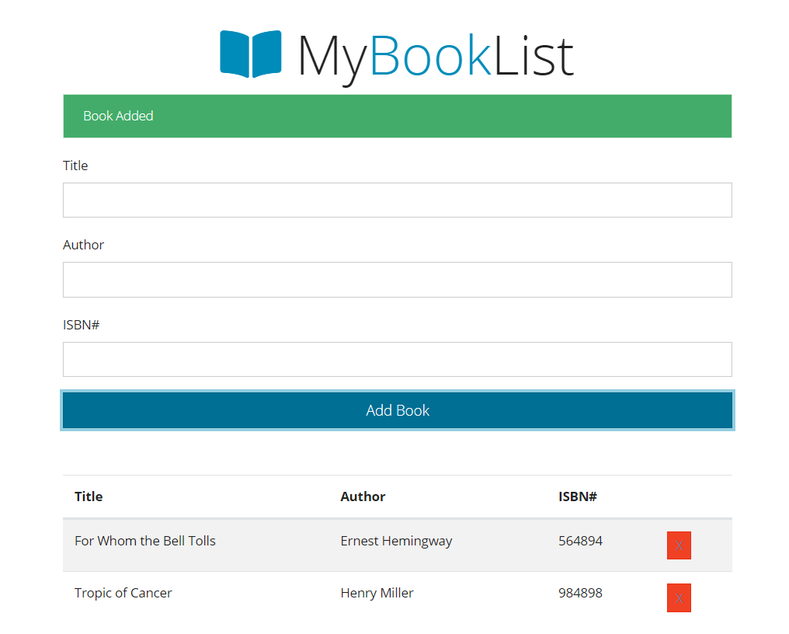
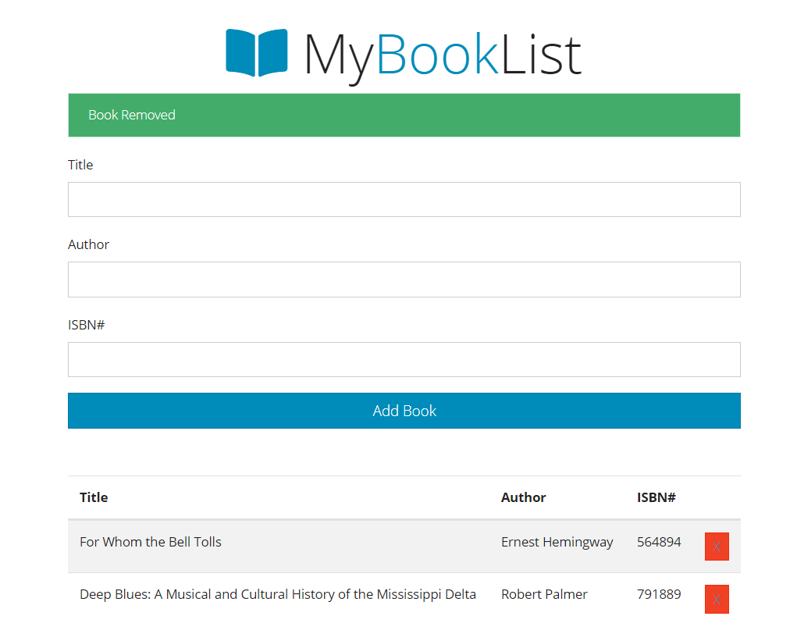
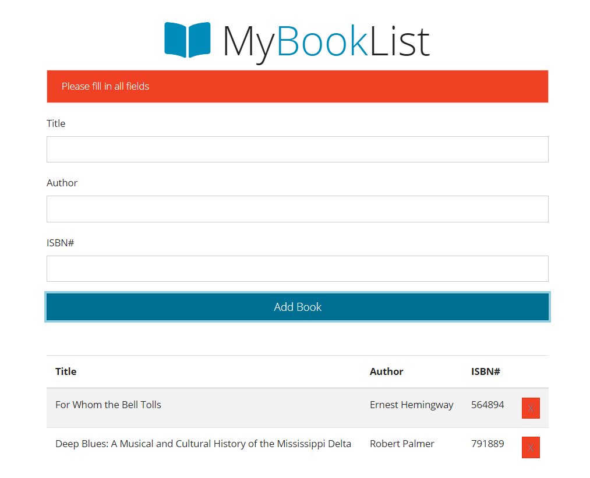

# JS-BookList

JavaScript Book List

<!-- Live link to deployed app -->

Repository: https://github.com/Mdudzik92/JS-BookList  
Deployed app: https://mdudzik92.github.io/JS-BookList/

<!-- Technologies used -->

HTML, Bootstrap, JavaScript, Local Storage

<!-- Explanation of what the app is -->

This app is written in object oriented style using ES6 classes. Interacting with Local storage using events, the user can input a book's title, author, and isbn to create a list of books listed in a table below. An alert lets them know if they haven't filled in all fields, and a separate alert lets them know if they've successfully added or removed a book from the list.

<!-- Screenshot -->

<!-- License -->

MIT

<!-- Contact information -->

Email: mdudzik92@gmail.com
